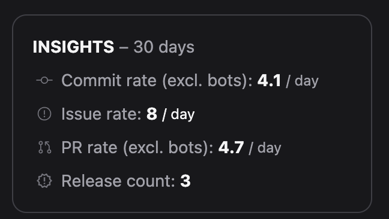
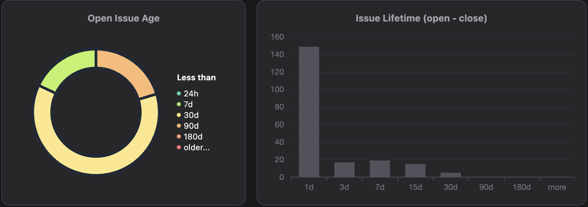

# **1. Tool Maturity and Stability**

Tool maturity can be evaluated through a combination of factors that indicate how stable and battle-tested the tool is in real-world scenarios. Below are some key criteria and methods to assess Pulumi's maturity:

### **Version History and Release Cadence**

Pulumi's version history and release cadence are strong indicators of its maturity. You can examine the frequency of updates, the introduction of major features, and the maintenance of backward compatibility. Regular updates demonstrate that the tool is actively maintained and evolving with the needs of its users.

- Pulumi has a consistent release schedule with regular updates. You can check the [Pulumi GitHub Releases](https://github.com/pulumi/pulumi/releases) page to see the history of versions and the significant changes introduced over time. Here are the last 30 day git stats from `repo-tracker` of pulumi repository and they are releasing a new version almost weekly is a promising rate.

### **Bug Fixes and Feature Requests**

Another aspect of tool maturity is how quickly and effectively bugs are fixed and feature requests are implemented. This can be analyzed by reviewing the open and closed issues on Pulumi's GitHub repository.

- By looking at the number of closed issues versus open ones, you can gauge how responsive the Pulumi team is in addressing problems and adding new features. Here are the last 180 day git stats. At some level, I can say that they are being active about closing most of the issues less 1 day. For a more detailed analysis, visit the [Pulumi GitHub Issues](https://github.com/pulumi/pulumi/issues) page.

### **Real-World Adoption**

The adoption of Pulumi by companies across various industries indicates its maturity and reliability. You can review case studies, testimonials, and customer success stories to understand how Pulumi is being used in production environments.

- Pulumi’s website has a [Case Studies](https://www.pulumi.com/case-studies/) section where you can explore how different organizations are leveraging Pulumi for their infrastructure needs.

# **2. Documentation Quality**
What I really appreciate about Pulumi's documentation is that it goes beyond just explaining how to use the tool. It covers a wide range of topics, from how to apply best practices, to how to organize your project structure according to your business needs, to how to set up CI/CD integrations, and much more. They even write blog posts on these subjects. It's not just focused on the SDK; it touches on all these areas comprehensively. Compared to Terraform, this has meant I needed to use Google less often, as I could find most of what I needed directly in their well-organized documentation. My experience has been very positive, as I'm able to find exactly what I'm looking for with ease.

**[Here, take a look](https://www.pulumi.com/docs/get-started/)**

**Conclusion**

That's all for this section, these were the key considerations that I will take into look to decide. So I will continue with next steps

[Back to Workshop](../README.md)
